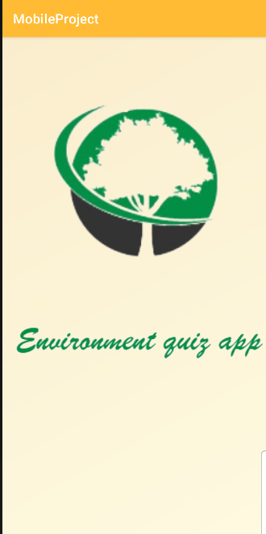
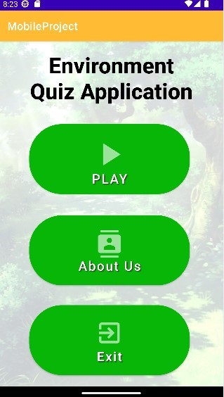
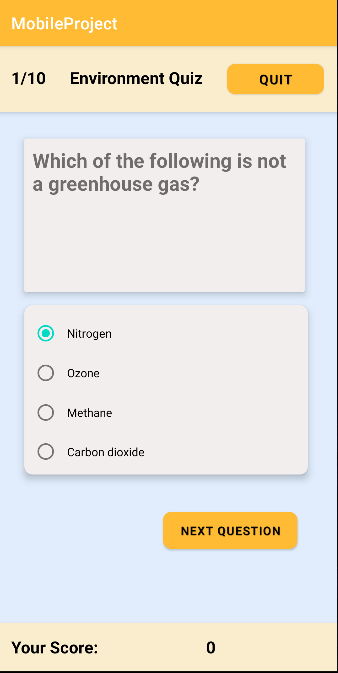

# Environment Quiz Mobile Application
This application is built using java and Android Studio. Our Mother Earth is currently facing a lot of environmental concerns. The environmental problems like global warming, acid rain, air pollution, urban sprawl, waste disposal, ozone layer depletion, water pollution, climate change and many more affect every human, animal, and nation on this planet. Over the last few decades, the exploitation of our planet and the degradation of our environment has gone up at an alarming rate. As our actions have been not in favour of protecting this planet, we have seen natural disasters striking us more often in the form of flash floods, earthquakes, blizzards, tsunamis, and cyclones. Nowadays, human keep exploiting the resources from the environment without considering the consequences of it. Those activity make the ecosystem of our environment become unbalance, environment pollution and causing the animals lose their habitat and facing extinction. The awareness among the people in preserving the environment should be increased before it’s too late. By developing this mobile application, we hope that we can raise the awareness of the society about the importance of the environment through fun and interesting stuff, for example answering quizzes about the environment through game.

# Group Members:
1. Poh Soon Heng B032010010 
2. Beh Kar Soon B032010466 
3. Sue Chen Xiang B032010034

# Results

## Splash Page

## Home Page

## Play Page

## Result Page

## About Page

